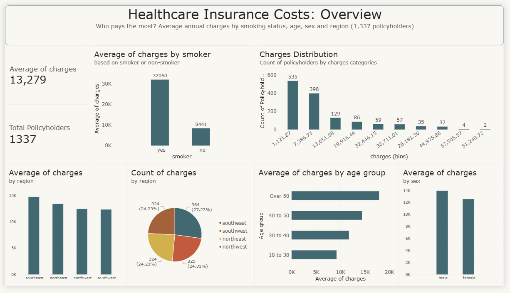
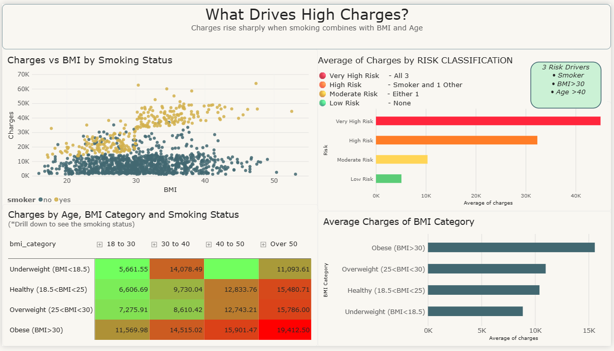

# Healthcare Insurance Cost Analysis

Exploratory data analysis of a healthcare insurance dataset to identify what drives medical insurance charges. The same analysis is implemented twice once in Python and once in R plus an interactive Power BI dashboard, so the project doubles as a comparison of both toolchains alongside a BI-tool deliverable.

## Project Scope

This repository currently includes:

- **Python EDA** — data cleaning (pandas), SQL querying (sqlite3), and visualization (seaborn/matplotlib) in a single Jupyter notebook.
- **R replication** — the same cleaning and charts re-implemented in R (dplyr, ggplot2), to compare both languages on the same questions. SQL querying is Python-only for now.
- **Power BI dashboard** — a two-page interactive dashboard built on the same dataset for business-facing exploration (see [Power BI Dashboard](#power-bi-dashboard) below).

## Dataset

`insurance.csv` — 1,338 records of US health insurance policyholders with the following fields:

| Column | Description |
|---|---|
| age | Age of the policyholder |
| sex | Gender |
| bmi | Body mass index |
| children | Number of dependents |
| smoker | Smoking status |
| region | US region of residence |
| charges | Annual medical insurance charges ($) |

## Tools

- Python (pandas, sqlite3, seaborn, matplotlib)
- R (dplyr, DBI/RSQLite, ggplot2)
- Power BI

## Key Findings

- **Smoking is the dominant cost driver.** Smokers pay ~$32,050 on average vs. ~$8,441 for non-smokers roughly 4x more.
- **BMI compounds risk mainly for smokers.** Charges correlate strongly with BMI for smokers (r ≈ 0.81) but barely at all for non-smokers (r ≈ 0.08). Smokers with a BMI over 30 pay ~$41,693 on average.
- **Age has a steady, moderate effect**, with average charges rising from ~$7,086 (ages 0-18) to ~$18,085 (ages 50+).
- **Region and sex have a smaller effect.** The southeast has the highest average charges (~$14,735), partly explained by having the highest average BMI (~33.4) of any region.

Full analysis, SQL queries, and charts are in [`Cleaning-Querying-Visualisation.ipynb`](Cleaning-Querying-Visualisation.ipynb) (Python). The R equivalent, covering cleaning and visualization, is viewable with results already rendered at [`eda_analysis.md`](eda_analysis.md) — no need to run R to see it.

## Business Recommendations

1. Prioritize smoking-cessation incentives, since smoking is the largest single driver of cost.
2. Use combined risk scoring (BMI × smoking status) for underwriting rather than single-factor thresholds.
3. Target wellness programs at high-BMI smokers, the highest-cost segment.
4. Review regional pricing in the southeast, where average BMI and charges are both elevated.
5. Monitor high-cost outliers separately for case management, since a small group of high-BMI smokers drives a disproportionate share of total cost.

## Running the Analysis

**Python:**
```bash
pip install -r requirements.txt
jupyter notebook Cleaning-Querying-Visualisation.ipynb
```

**R:**

Results are already rendered in [`eda_analysis.md`](eda_analysis.md) — just open it, no R installation needed. To run it yourself:
```bash
Rscript eda_analysis.R          # runs the analysis, plots open interactively
```
or open [`eda_analysis.Rmd`](eda_analysis.Rmd) in RStudio and knit it to regenerate `eda_analysis.md` with fresh output. Requires the `dplyr` and `ggplot2` packages (`install.packages(c("dplyr", "ggplot2"))`), plus `rmarkdown`/`knitr` and Pandoc if re-knitting.

## Python vs. R: Notes

Both run the same cleaning logic against the same dataset, so the underlying findings match the difference is in the toolchain:

- **Syntax style**: pandas is more imperative; R's dplyr pipeline (`%>%`) reads as a chain of verbs, which some find more readable for step-by-step data manipulation.
- **Visualization**: seaborn/matplotlib and ggplot2 produce comparable charts, but ggplot2's layered grammar-of-graphics syntax (`+` to add layers) is often considered faster for iterating on plot aesthetics.
- **Result sharing**: a Jupyter notebook stores code and output together natively; R's equivalent is R Markdown (`.Rmd`) knitted to a GitHub-flavored doc (`eda_analysis.md`), which is what's used here so results are visible without running anything.
- **Ecosystem fit**: Python is generally stronger for general-purpose scripting, automation, and downstream ML; R remains a strong choice for statistics-heavy analysis and is widely used in academic/health-research settings — relevant given this is a healthcare dataset.

## Power BI Dashboard

A two-page interactive dashboard that turns the analysis into a business-facing view: page 1 answers *who pays the most*, page 2 answers *why*.

### Page 1 — Overview: Who Pays the Most?



- **Headline KPIs:** average annual charge of **$13,279** across **1,337** policyholders.
- **Smoking:** smokers pay **$32,050** on average vs. **$8,441** for non-smokers — nearly 4x.
- **Distribution:** most policyholders fall in the lower charge bands, with a long tail of high-cost cases.
- **Region:** the southeast has both the highest average charge (**$14,735**) and the most policyholders (**364**, 27%); the other three regions are almost equal in size.
- **Age:** average charges climb steadily with age, from about **$9K** (18–30) to about **$18K** (over 50).
- **Sex:** men average slightly more than women (about **$14K** vs. **$12.6K**), a much smaller gap than smoking or age.

### Page 2 — What Drives High Charges?



- **Charges vs. BMI:** smokers' charges climb sharply once BMI passes 30, while non-smokers stay low at any BMI.
- **Risk classification:** a custom risk score built from three drivers — **smoker**, **BMI > 30**, **age > 40**. Policyholders with all three ("Very High Risk") average over **$40,000**, compared with ~**$5,000** for those with none.
- **Age × BMI heatmap:** costs are highest where older age and obesity overlap. Drill down to split each cell by smoking status.
- **BMI category:** obese policyholders have the highest average charges of any BMI group.

### Opening the Dashboard

The dashboard is saved as a Power BI template, [`dashboard/healthcare-insurance-dashboard.pbit`](dashboard/healthcare-insurance-dashboard.pbit). To explore it:

1. Download this repository and open the `.pbit` file in [Power BI Desktop](https://powerbi.microsoft.com/desktop/).
2. If Power BI can't find the data, go to **Transform data → Data source settings → Change Source** and select `insurance.csv` from this repository.

## Project Structure

```
.
├── Cleaning-Querying-Visualisation.ipynb   # Python: cleaning, SQL queries, visualizations
├── eda_analysis.R                          # R: same cleaning and charts, plain script
├── eda_analysis.Rmd                        # R: source for the knitted results doc below
├── eda_analysis.md                         # R: rendered results (view directly on GitHub)
├── eda_analysis_files/                     # Chart images embedded in eda_analysis.md
├── dashboard/
│   ├── healthcare-insurance-dashboard.pbit  # Power BI dashboard (template)
│   ├── dashboard-overview.png               # Screenshot: page 1, Overview
│   └── dashboard-risk-drivers.png           # Screenshot: page 2, Risk Drivers
├── insurance.csv                            # Source dataset
├── requirements.txt                         # Python dependencies
└── README.md
```
