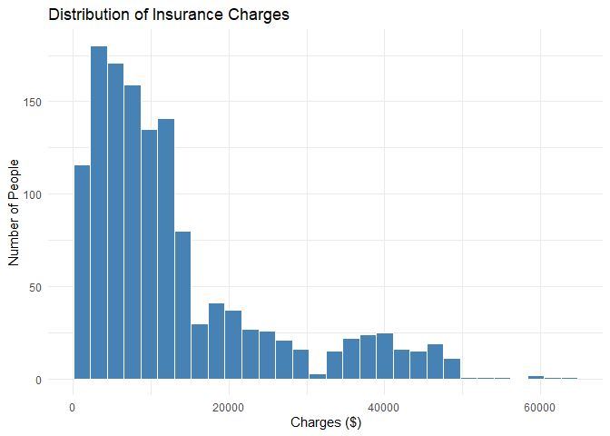
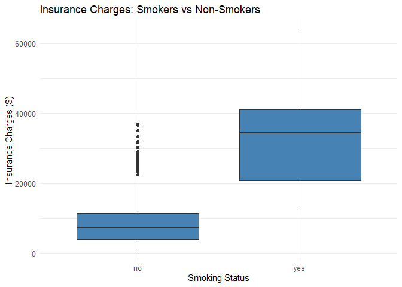
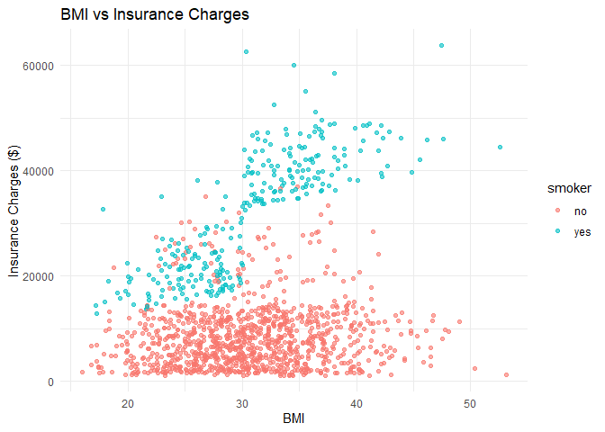
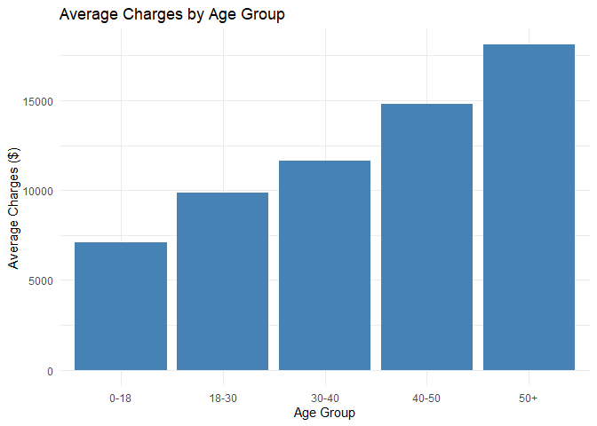

Healthcare Insurance Cost Analysis - R
================

## Overview

This document replicates the data cleaning and visualization steps from
the Python notebook
([`Cleaning-Querying-Visualisation.ipynb`](Cleaning-Querying-Visualisation.ipynb))
using R: `dplyr` for cleaning and `ggplot2` for visualization. It’s a
side-by-side comparison of the two toolchains on the same dataset and
the same questions. SQL querying is covered separately in the Python
notebook — see the main [README](README.md) for the full write-up of key
findings and business recommendations.

## Setup

``` r
library(dplyr)
```

    ## 
    ## Attaching package: 'dplyr'

    ## The following objects are masked from 'package:stats':
    ## 
    ##     filter, lag

    ## The following objects are masked from 'package:base':
    ## 
    ##     intersect, setdiff, setequal, union

``` r
library(ggplot2)
```

## Data Inspection

``` r
df <- read.csv("insurance.csv", stringsAsFactors = FALSE)
head(df)
```

    ##   age    sex    bmi children smoker    region   charges
    ## 1  19 female 27.900        0    yes southwest 16884.924
    ## 2  18   male 33.770        1     no southeast  1725.552
    ## 3  28   male 33.000        3     no southeast  4449.462
    ## 4  33   male 22.705        0     no northwest 21984.471
    ## 5  32   male 28.880        0     no northwest  3866.855
    ## 6  31 female 25.740        0     no southeast  3756.622

The first six rows confirm the dataset’s structure: age, sex, BMI,
number of children, smoking status, region, and insurance charges.

``` r
str(df)
```

    ## 'data.frame':    1338 obs. of  7 variables:
    ##  $ age     : int  19 18 28 33 32 31 46 37 37 60 ...
    ##  $ sex     : chr  "female" "male" "male" "male" ...
    ##  $ bmi     : num  27.9 33.8 33 22.7 28.9 ...
    ##  $ children: int  0 1 3 0 0 0 1 3 2 0 ...
    ##  $ smoker  : chr  "yes" "no" "no" "no" ...
    ##  $ region  : chr  "southwest" "southeast" "southeast" "northwest" ...
    ##  $ charges : num  16885 1726 4449 21984 3867 ...

All 1,338 rows have complete values across all seven columns, and each
column’s data type (numeric vs. categorical) is as expected.

``` r
summary(df)
```

    ##       age               sex            bmi           children    
    ##  Min.   :18.00   Length   :1338   Min.   :15.96   Min.   :0.000  
    ##  1st Qu.:27.00   N.unique :   2   1st Qu.:26.30   1st Qu.:0.000  
    ##  Median :39.00   N.blank  :   0   Median :30.40   Median :1.000  
    ##  Mean   :39.21   Min.nchar:   4   Mean   :30.66   Mean   :1.095  
    ##  3rd Qu.:51.00   Max.nchar:   6   3rd Qu.:34.69   3rd Qu.:2.000  
    ##  Max.   :64.00                    Max.   :53.13   Max.   :5.000  
    ##        smoker           region        charges     
    ##  Length   :1338   Length   :1338   Min.   : 1122  
    ##  N.unique :   2   N.unique :   4   1st Qu.: 4740  
    ##  N.blank  :   0   N.blank  :   0   Median : 9382  
    ##  Min.nchar:   2   Min.nchar:   9   Mean   :13270  
    ##  Max.nchar:   3   Max.nchar:   9   3rd Qu.:16640  
    ##                                    Max.   :63770

Summary statistics show ages ranging from 18-64 and BMI from roughly
16-53, while charges range from about \$1,122 to \$63,770 — a wide
spread suggesting a right-skewed distribution driven by a subset of
high-cost individuals.

``` r
dim(df)
```

    ## [1] 1338    7

The dataset contains 1,338 rows and 7 columns before cleaning.

``` r
sapply(df[c("sex", "children", "smoker", "region")], unique)
```

    ## $sex
    ## [1] "female" "male"  
    ## 
    ## $children
    ## [1] 0 1 3 2 5 4
    ## 
    ## $smoker
    ## [1] "yes" "no" 
    ## 
    ## $region
    ## [1] "southwest" "southeast" "northwest" "northeast"

Each categorical column (sex, children, smoker, region) contains only
expected, clean values with no typos or inconsistent categories.

## Data Cleaning

``` r
sum(duplicated(df))
```

    ## [1] 1

``` r
df[duplicated(df) | duplicated(df, fromLast = TRUE), ]
```

    ##     age  sex   bmi children smoker    region  charges
    ## 196  19 male 30.59        0     no northwest 1639.563
    ## 582  19 male 30.59        0     no northwest 1639.563

One exact duplicate row is found in the dataset (a 19-year-old male from
the northwest), shown here before removal.

``` r
df <- distinct(df)
cat("Remaining duplicates:", sum(duplicated(df)), "\n")
```

    ## Remaining duplicates: 0

``` r
cat("Shape after cleaning:", nrow(df), "rows,", ncol(df), "columns\n")
```

    ## Shape after cleaning: 1337 rows, 7 columns

After removing the duplicate, the dataset is reduced to 1,337 clean,
unique rows ready for analysis.

## Data Visualisation

``` r
ggplot(df, aes(x = charges)) +
  geom_histogram(bins = 30, fill = "steelblue", color = "white") +
  labs(title = "Distribution of Insurance Charges",
       x = "Charges ($)", y = "Number of People") +
  theme_minimal()
```

<!-- -->

Most charges are concentrated below \$15,000, with a long right tail
stretching out to about \$63,000 — a skew that matches the small group
of high-BMI smokers who pay dramatically more than everyone else.

``` r
ggplot(df, aes(x = smoker, y = charges)) +
  geom_boxplot(fill = "steelblue") +
  labs(title = "Insurance Charges: Smokers vs Non-Smokers",
       x = "Smoking Status", y = "Insurance Charges ($)") +
  theme_minimal()
```

<!-- -->

There’s a stark separation between the two groups: even the
highest-charged non-smokers fall around the median of the smoking group,
confirming that smoking status alone explains a large share of the
variation in insurance cost.

``` r
ggplot(df, aes(x = bmi, y = charges, color = smoker)) +
  geom_point(alpha = 0.6) +
  labs(title = "BMI vs Insurance Charges",
       x = "BMI", y = "Insurance Charges ($)") +
  theme_minimal()
```

<!-- -->

BMI has little relationship with charges for non-smokers, but a strong
positive relationship for smokers — visually confirming that BMI mainly
drives up cost when combined with smoking.

``` r
df$age_group <- cut(df$age,
                     breaks = c(0, 18, 30, 40, 50, 100),
                     labels = c("0-18", "18-30", "30-40", "40-50", "50+"))

df %>%
  group_by(age_group) %>%
  summarise(avg_charge = mean(charges)) %>%
  ggplot(aes(x = age_group, y = avg_charge)) +
  geom_col(fill = "steelblue") +
  labs(title = "Average Charges by Age Group",
       x = "Age Group", y = "Average Charges ($)") +
  theme_minimal()
```

<!-- -->

Average charges rise steadily with age, reflecting the expected increase
in health risk and claims as policyholders get older.

## Conclusion

These results match the Python notebook’s visual analysis exactly, since
both work from the same cleaned dataset. See the [README](README.md) for
the full write-up of key findings and business recommendations, and
[`Cleaning-Querying-Visualisation.ipynb`](Cleaning-Querying-Visualisation.ipynb)
for the SQL-based analysis.
